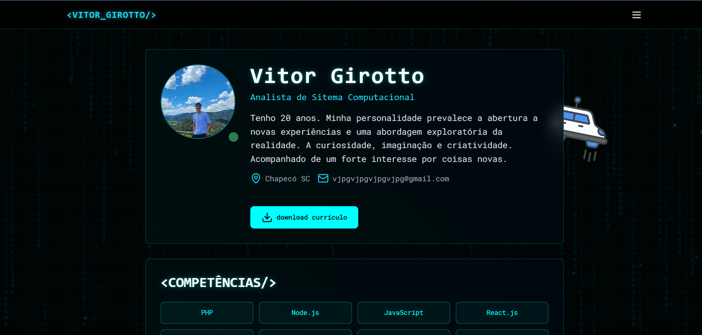

# 💻 Portfólio / Currículo Online

Este repositório contém o código-fonte de uma página de currículo interativo e portfólio, desenvolvida para demonstrar habilidades técnicas em **front-end**, integração com **design futurista** e uso de **tecnologias modernas**.

## 🚀 Objetivo

Criar uma **landing page** que funcione como currículo online e vitrine de projetos, com foco em:

* **Apresentação visual moderna**, inspirada em estética cyberpunk (efeitos neon, animações em canvas).
* **Organização clara** de projetos, certificados e competências.
* **Tecnologias web recentes**, explorando Tailwind CSS, ícones vetoriais dinâmicos, efeitos em JavaScript.

---

## 🗂️ Estrutura do repositório

* **`index.html`**: Estrutura principal da página.
    * Implementa navegação dinâmica (seções "Perfil", "Cursos", "Experiências", "Projetos").
    * Usa **Tailwind CSS** para layout responsivo e efeitos.
    * Inclui animações com canvas (matrix e partículas).
* **`style.css`**: Estilos adicionais e customizações específicas (ex.: glow, efeitos neon).
    * Classes utilitárias que complementam Tailwind para o tema futurista.
* **`script.js`**: Gerencia a lógica de navegação entre seções (mostrar/ocultar).
    * Scripts para animações e interatividade do canvas (efeito matrix, partículas flutuando).
    * Controle de menu mobile e comportamento dos botões.
* **`certificados/`**: Arquivos PDF e imagens de cursos, que são exibidos dinamicamente na página de cursos.
* **`imagem/`**: Imagens gerais usadas no perfil (foto, ícone do currículo, carro animado, etc.).
* **`projetos/`**: Imagens de capa para representar cada projeto no portfólio.

---

## 🛠️ Tecnologias e recursos usados

* **HTML5** e **JavaScript puro** (sem frameworks pesados para JS).
* **Tailwind CSS** para construção rápida e responsiva.
* **Lucide Icons** (via CDN) para ícones vetoriais escaláveis.
* **Canvas API** para animações (matrix, partículas).
* **Google Fonts** (Orbitron e Roboto Mono), dando um ar técnico e futurista.

---

## 💡 Funcionalidades principais

* ✅ Página totalmente **responsiva**, adaptada para mobile e desktop.
* ✅ **Efeitos visuais** com camadas (scan lines, glow, canvas).
* ✅ **Download direto** do currículo em PDF.
* ✅ **Navegação intuitiva** e dinâmica (SPA-like).
* ✅ **Animações customizadas** sem depender de bibliotecas externas pesadas.
* ✅ Uso modular de imagens e certificados, **fácil manutenção**.
